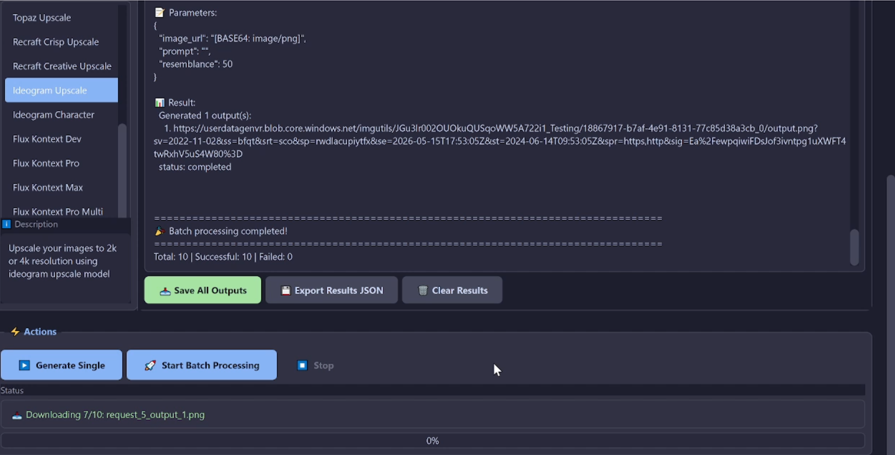
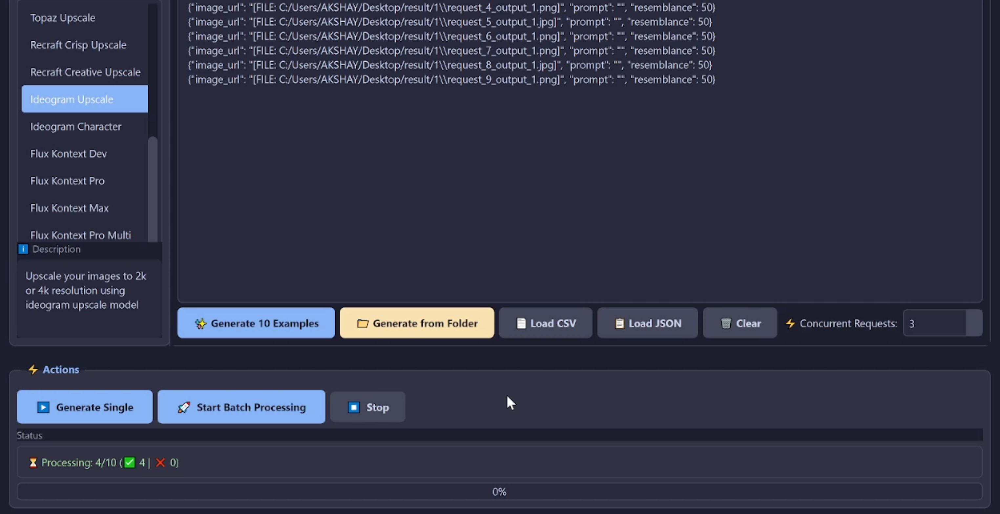

# 🎨 GenVR Batch Processor

**A powerful desktop application for batch processing 300+ AI models from the GenVR API**

Process images, videos, audio, and more with an intuitive interface designed for both single requests and massive batch operations.

[](https://www.python.org/downloads/)
[](https://pypi.org/project/PySide6/)
[](LICENSE)



---

## ✨ Key Features

### 🎯 **300+ AI Models**
- **Image Generation:** DALL-E, Stable Diffusion, Flux, Nano Banana, and more
- **Video Generation:** Runway, Veo3, Pika, Kling, and more
- **Image Utilities:** Upscaling, enhancement, editing, face swap
- **Audio & 3D:** Voice synthesis, music generation, 3D model creation

### 🚀 **Powerful Batch Processing**
- Process **hundreds of requests** concurrently
- **Real-time results** - See outputs as they complete
- **Adjustable concurrency** (1-10 simultaneous requests)
- **Stop/Resume** capability
- **Progress tracking** with success/failure counts

### 📁 **Smart File Handling**
- **Automatic base64 conversion** for file uploads
- **Folder-to-batch** generation - Select folder, get instant JSON
- **Array field support** - Multiple files per request
- **Auto-download** all outputs to folder

### 🎚️ **Intelligent UI**
- **Auto-generated forms** based on model schema
- **Sliders** for numeric ranges
- **Dropdowns** for enums
- **File browsers** for uploads
- **Validation** and error handling

### 💾 **Result Management**
- **Save all outputs** with one click
- **Export results** as JSON
- **Clean display** - No base64 clutter
- **Timestamped logs**

---

## 🖥️ Screenshot


*Modern dark theme with real-time batch processing*

---

## 🚀 Quick Start

### Windows Users

1. **Install Python 3.8+** ([Download here](https://www.python.org/downloads/))
   - ⚠️ Check "Add Python to PATH" during installation

2. **Download this repository:**
   - Click the green "Code" button → "Download ZIP"
   - Extract to a folder

3. **Double-click `run_qt.bat`**
   - First run installs dependencies automatically
   - Application launches!

### Mac/Linux Users

```bash
# Clone repository
git clone https://github.com/yourusername/GenVR-Batch-Processor.git
cd GenVR-Batch-Processor

# Install dependencies
pip3 install -r requirements.txt

# Run application
python3 main_qt.py
```

Or use the shell script:
```bash
chmod +x run_qt.sh
./run_qt.sh
```

📖 **[Detailed Installation Guide →](INSTALL.md)**

---

## 📖 Usage

### 1. Configure API Credentials

**Option 1: Use .env file (Recommended)**
1. Open the `.env` file in the project root
2. Add your credentials:
   ```
   GENVR_UID=your-user-id-here
   GENVR_TOKEN=your-api-token-here
   ```
3. The application will automatically load these values when you start it

**Option 2: Enter in the application**
```
┌─────────────────────────────┐
│ 🔑 API Configuration        │
├─────────────────────────────┤
│ User ID:  [your-uid]        │
│ API Key:  [••••••••]        │
└─────────────────────────────┘
```

Get credentials from [GenVR Research's API platform](https://api.genvrresearch.com/obtain-api)

### 2. Select Model

- **Category:** imagegen
- **Model:** google_imagen4
- Parameters load automatically!

### 3. Generate

**Single Request:**
```
Fill parameters → Click "▶️ Generate Single"
```

**Batch Processing:**
```
Method 1: Click "✨ Generate 10 Examples"
Method 2: Click "📁 Generate from Folder" (for file models)
Method 3: Paste your own JSON

Then: Click "🚀 Start Batch Processing"
```

### 4. Save Results

```
Results tab → "📥 Save All Outputs" → Select folder → Done!
```

---

## 🎯 Use Cases

### Image Generation Batch
```
Generate 100 variations of product images
→ Use "Generate 10 Examples" 
→ Edit prompts
→ Process all at once
```

### Video Processing
```
Enhance 50 videos
→ Select video enhancement model
→ "Generate from Folder"
→ Select video folder
→ Process batch
→ Download all
```

### Face Swap Batch
```
Swap faces across 100 images
→ Select face swap model (array field)
→ "Generate from Folder"
→ Folder 1: Source faces
→ Folder 2: Target images
→ Generates paired JSON
→ Process all
```

---

## 🛠️ Technical Details

### Architecture
- **Frontend:** PySide6 (Qt Framework)
- **Backend:** Python 3.8+
- **API Client:** requests library
- **Threading:** QThread for async operations
- **Concurrency:** ThreadPoolExecutor for batch processing

### API Workflow
```
1. POST /v2/generate    → task_id
2. POST /v2/status      → poll until "completed"
3. POST /v2/response    → get results
```

### File Handling
- Automatic base64 encoding: `data:image/png;base64,...`
- MIME type detection
- Cross-platform path handling
- Duplicate prevention (Windows case-insensitivity)

---

## 🔧 Configuration Files

### `requirements.txt`
```
requests>=2.31.0
PySide6>=6.6.0
python-dotenv>=1.0.0
```

### `.env` file
1. Copy `.env.example` to `.env`:
   ```bash
   cp .env.example .env
   ```
2. Edit `.env` and add your credentials:
   ```
   GENVR_UID=your-user-id-here
   GENVR_TOKEN=your-api-token-here
   ```
3. The application will automatically load these values on startup. If the file doesn't exist or values are empty, you can enter them manually in the application.

**Note:** The `.env` file is ignored by git (see `.gitignore`) to protect your credentials.

### API Endpoints
- Models: `https://api.genvrresearch.com/api/models`
- Schema: `https://api.genvrresearch.com/api/schema/:category/:subcategory`
- Generate: `https://api.genvrresearch.com/v2/generate`
- Status: `https://api.genvrresearch.com/v2/status`
- Response: `https://api.genvrresearch.com/v2/response`

---

## 🐛 Known Issues

- **Large files:** Base64 conversion can be slow for large videos
- **Network:** Requires stable internet for API calls
- **Memory:** Processing 100+ large files may require 8GB+ RAM

---

## 🗺️ Roadmap

- [ ] Result caching
- [ ] Resume interrupted batches
- [ ] CSV export of results
- [ ] Custom templates
- [ ] API rate limiting visualization
- [ ] Multi-language support

---

## 📄 License

MIT License - See [LICENSE](LICENSE) file

---

## 🙏 Acknowledgments

- GenVR Research for the amazing API
- Qt/PySide6 team for the UI framework
- Python community for excellent libraries

---

## ⭐ Star This Project!

If you find this useful, please give it a star! It helps others discover the project.

**Happy Generating!** 🎨🎬🖼️
